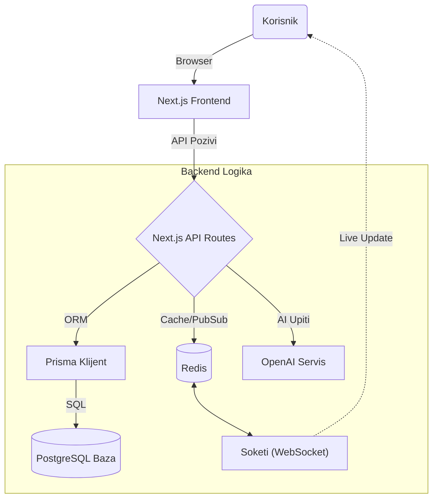
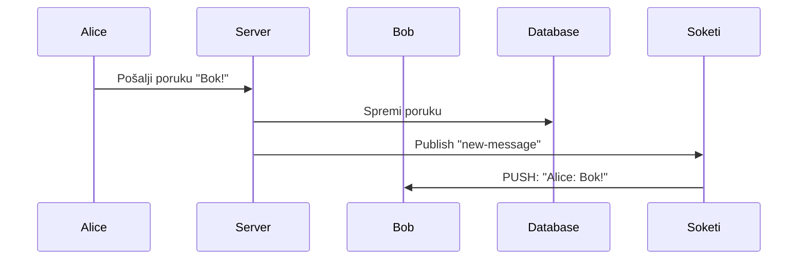

# DFDS: Dokumentacija Sustava

> **Verzija**: 1.1.0  
> **Status**: Spremno za Produkciju 

---

##  Uvod (O Projektu)

Bok! Dobrodošli u **DFDS** – platformu koju smo izgradili tijekom natjecanja. Naš tim je **Team Cloudzz**.

Naš cilj nije bio samo napraviti još jedan LinkedIn, već stvoriti **ekosustav** gdje se startup timovi zapravo *grade*. Koristimo moderni stack (Next.js, Prisma, AI) kako bi sve letjelo, a korisničko iskustvo bilo vrhunsko. Demo možete pogledati na [dfds.cloudzz.dev](https://dfds.cloudzz.dev).

Ovdje ćemo proći kroz to **kako stvari zapravo rade ispod haube**.

---

## -Kako Sustav "Diše" (Arhitektura)

DFDS je **hibridna cloud aplikacija**. To znači da kombiniramo brzinu statičkog weba (Next.js) s dinamikom stvarnog vremena (WebSockets).

Evo kako podaci putuju kroz sustav:



**Ukratko:**
1.  **Frontend**: Sve što vidite je React, ali renderiran na serveru (SSR) za brzinu.
2.  **Baza**: PostgreSQL čuva sve - od profila do poruka.
3.  **Real-time**: Kad pošaljete poruku, ona ide kroz Redis do Soketija, koji je odmah "gura" primatelju. Nema osvježavanja stranice.

---

## Struktura Koda (Deep Dive)

Ako otvarate projekt prvi put, evo gdje se što nalazi. Organizirani smo da se lako snađete:

### `/app` (Mozak Operacije)
Ovo je Next.js App Router. Struktura mapa prati URL-ove u pregledniku.
*   `api/` - Naš backend. Ovdje su rute za registraciju, chat, AI.
*   `dashboard/` - Zaštićeni dio aplikacije (samo za ulogirane korisnike).
*   `layout.tsx` - Glavni okvir (headeri, fontovi, providers).

### `/components` (Lego Kockice)
Sve vizualno je ovdje.
*   `ui/` - Male komponente (gumbi, kartice, inputi). Koristimo *glassmorphism* stil.
*   `landing/` - Sve što vidite na naslovnoj stranici (Hero sekcija).
*   `dashboard/` - Kompleksnije komponente poput grafova i tablica.

### `/lib` (Alati)
Pomoćne funkcije koje koristimo svugdje.
*   `prisma.ts` - Jedan "otvor" prema bazi podataka.
*   `auth.ts` - Logika za prijavu i sesije.
*   `utils.ts` - Male funkcije za formatiranje datuma, klasa itd.

### `/prisma` (Baza)
*   `schema.prisma` - **Najvažnija datoteka**. Ovdje definiramo kako izgledaju podaci (Korisnik, Startup, Poruka). Ako mijenjate bazu, mijenjate ovu datoteku.

---

##  Ključne Funkcionalnosti (Under the Hood)

### 1. Smart Matching (Pametno Povezivanje)
Ne spajamo ljude nasumično. Algoritam gleda:
*   **Vještine**: (npr. traži se React + Node.js)
*   **Interese**: (npr. Fintech, AI)
*   **Ulogu**: (Founder traži Co-foundera)

### 2. Live Chat Sustav
Ovo nije običan chat. Koristimo **WebSockete** za trenutnu komunikaciju.
*   **Pusher Protokol**: Koristimo `pusher-js` na klijentu i `soketi` na serveru.
*   **Sigurnost**: Svaki kanal je privatan i autoriziran.



### 3. AI konzultant
Integrirali smo GPT-4 izravno u dashboard.
*   Korisnik unese ideju.
*   API šalje prompt u OpenAI s "kontekstom" (npr. "Ponašaj se kao iskusni VC investitor").
*   Vraćamo strukturirani savjet (SWOT analiza, Monetizacija).

---

## Kako Pokrenuti (Quick Start)

Napravili smo skriptu da ne morate tipkati 10 naredbi.

1.  **Skinite kod**:
    ```bash
    git clone https://github.com/Cloudzz-dev/dfds.git
    cd dfds
    ```

2.  **Pokrenite skriptu** (treba vam Docker):
    ```bash
    ./deploy.sh full
    ```
    *Ovo će podići bazu, aplikaciju, Redis i sve servise koji su potrebni.*

3.  **Otvorite**: `http://localhost:3753`

> **Pro Tip**: Ako želite vidjeti logove, samo ukucajte `./deploy.sh logs`.

---

## Environment Varijable 

Projekt koristi razne vanjske servise. Za potrebe Hackathona, **aplikacija će se pokrenuti i raditi** i bez većine ovih ključeva, ali određene funkcionalnosti neće biti dostupne.

Evo popisa ključeva koje je korisno znati:

| Varijabla | Obavezna? | Što radi? | Posljedica ako nedostaje |
| :--- | :--- | :--- | :--- |
| `DATABASE_URL` |  Da | Veza na PostgreSQL bazu. | App se ne pokreće. (Postavljeno automatski u Dockeru) |
| `NEXTAUTH_SECRET` |  Da | Enkripcija sesija. | Login ne radi. (Postavljeno automatski u Dockeru) |
| `OPENAI_API_KEY` |  Ne | **AI Konzultant** (Dashboard). | AI funkcionalnosti (SWOT analize) neće raditi. |
| `RESEND_API_KEY` |  Ne | Slanje e-mailova (invite). | Pozivnice za timove neće stizati na mail. |
| `GITHUB_ID` / `SECRET` |  Ne | Prijava putem GitHuba. | Gumb "Sign in with GitHub" neće raditi. |
| `GOOGLE_ID` / `SECRET` |  Ne | Prijava putem Googlea. | Gumb "Sign in with Google" neće raditi. |

> **Napomena**: Ako pokrećete putem `./deploy.sh`, svi **infrastrukturni** ključevi (Baza, Redis, Websoketi) su već automatski konfigurirani! Trebate unijeti samo API ključeve za vanjske servise (OpenAI, Resend, OAuth) u `.env` filu ako želite isprobati te specifične funkcionalnosti. Resend i Oauth mozete dobiti besplatno. za OpenAI trebate uplaitit novac u OpenAI-ovu platfromu da bi ste mogli koristit AI funkcionalnosti.

---

## Sigurnost (Security First)
Nismo zaboravili na sigurnost.
*   **Password Hashing**: Ne spremamo lozinke u plain textu nego ih kriptografksi hashiramo (Bcrypt).
*   **Rate Limiting**: Redis pazi da nitko ne spamma API i cacha requestove.
*   **Sanitizacija**: Inputi se ciste prije nego dotaknu bazu podataka ili API.

---

*Hvala što koristite DFDS. Gradimo budućnost zajedno!*  
*- Tim Cloudzz*
