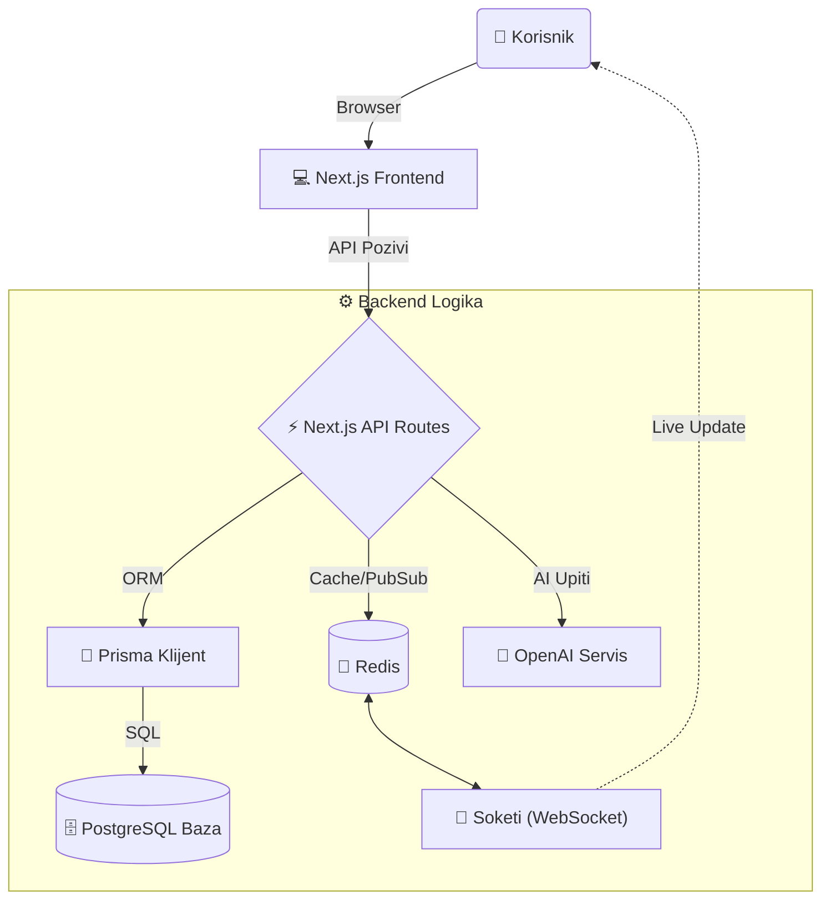

# DFDS: Dokumentacija Sustava

> **Verzija**: 1.2.0  
> **Status**: Spremno za Produkciju 
> **Tim**: Team Cloudzz

---

## 📖 Uvod (O Projektu)

Bok! Dobrodošli u **DFDS** – naprednu platformu koju smo izgradili s ciljem revolucije startup ekosustava. Naš tim, **Team Cloudzz**, fokusirao se na rješavanje stvarnog problema: *nepovezanosti između inovatora (Foundera), graditelja (Developera) i investitora.*

Naš cilj nije bio samo napraviti još jedan LinkedIn, već stvoriti **živi ekosustav** gdje se startup timovi zapravo *grade* i financiraju. Koristimo moderni "bleeding-edge" stack (Next.js, Prisma, AI, WebSockets) kako bi aplikacija bila brza, responzivna i spremna za skaliranje.

Glavne značajke:
*   **Smart Matching**: Algoritamsko povezivanje talenata.
*   **Real-time Komunikacija**: Chat bez kašnjenja.
*   **AI Konzultant**: Instant povratne informacije na poslovne ideje.
*   **Investicijski Dashboard**: Transparentno praćenje financiranja.

---

## 🏗️ Kako Sustav "Diše" (Arhitektura)

DFDS je **hibridna cloud aplikacija**. Kombiniramo brzinu statičkog weba (Next.js SSR) s dinamikom stvarnog vremena (WebSockets).

Evo kako podaci putuju kroz sustav:



**Ukratko:**
1.  **Frontend**: Sve što vidite je React, ali renderiran na serveru (SSR) za SEO i brzinu.
2.  **Baza**: PostgreSQL čuva sve podatke - od profila korisnika do transakcija.
3.  **Real-time**: Kad pošaljete poruku, ona ide kroz Redis do Soketija, koji je odmah "gura" primatelju. Nema osvježavanja stranice ("F5").

---

## 📱 Korisničke Upute (User Guide)

Ovdje možete vidjeti kako aplikacija izgleda i funkcionira u praksi. Pokrili smo svaki dio sustava.

### 1. Naslovna Stranica (Landing Page)
Prvi kontakt s aplikacijom. Dizajnirana je da bude čista i jasna, odmah objašnjavajući vrijednost platforme.


### 2. Glavni Dashboard
Kontrolna ploča za korisnika. Ovdje Founder može vidjeti ključne metrike: prikupljena sredstva, doseg ("Runway") i aktivnost korisnika.


### 3. Pregled Startupa (Startups Grid)
Srce platforme. Investitori i developeri ovdje pregledavaju aktivne startupe. Kartice prikazuju fazu financiranja (npr. "Series A") i omogućuju direktno povezivanje.


### 4. Poruke i Chat (Real-time)
Integrirani sustav za dopisivanje. Omogućuje direktnu komunikaciju između investitora i osnivača bez napuštanja platforme.


### 5. Investitori (Investors)
Prikaz aktivnih investitora na platformi, njihov fokus (npr. SaaS, AI) i prosjek ulaganja ("Check Size").


### 6. Mreža Developera (Network)
Baza talenata. Founder ovdje može pronaći developere prema vještinama (React, Node.js) i iskustvu.


### 7. Diskusije i Zajednica (Threads)
Forum gdje korisnici raspravljaju o tehnologiji, traže savjete ili partnere za hackathone.


### 8. Plan Razvoja (Roadmap)
Transparentni prikaz budućih značajki platforme gdje korisnici mogu glasati za ono što žele sljedeće.


### 9. Postavke Profila (Settings)
Upravljanje korisničkim računom, avatarima i osobnim podacima.


---

## 🔌 API Dokumentacija

Aplikacija izlaže RESTful API koji koristi frontend, ali se može koristiti i za integracije. Svi odgovori su u `JSON` formatu.

### Autentifikacija
Većina ruta zahtijeva aktivnu sesiju (NextAuth).

### 1. Registracija (Register)
Stvara novog korisnika u sustavu.

*   **Endpoint**: `POST /api/register`
*   **Body (JSON)**:
    ```json
    {
      "name": "Ivan Horvat",
      "email": "ivan@primjer.com",
      "password": "sigurna_lozinka_123",
      "role": "FOUNDER", // Opcije: FOUNDER, DEVELOPER, INVESTOR
      "startupName": "Moja Firma" // Samo za FOUNDER role
    }
    ```

### 2. Dohvat Startupa (Get Startups)
Vraća paginiranu listu startupa.

*   **Endpoint**: `GET /api/startups`
*   **Query Params**:
    *   `page`: Broj stranice (default: 1)
    *   `limit`: Broj zapisa (default: 25)
*   **Response**:
    ```json
    [
      {
        "id": "cuid123...",
        "name": "EcoInc",
        "stage": "Seed",
        "founder": { "name": "Marko Ivic" }
      },
      ...
    ]
    ```

### 3. Kreiranje Startupa (Create Startup)
Omogućuje korisniku (Founderu) da registrira svoj startup.

*   **Endpoint**: `POST /api/startups`
*   **Zahtijeva Auth**: Da
*   **Body (JSON)**:
    ```json
    {
      "name": "Nova Aplikacija",
      "pitch": "Revolucija u AI...",
      "stage": "Pre-seed",
      "websiteUrl": "https://nova-app.com",
      "teamSize": 5,
      "raised": "$0"
    }
    ```

### 4. Slanje Poruke (Send Message)
Šalje privatnu poruku drugom korisniku.

*   **Endpoint**: `POST /api/messages/send`
*   **Zahtijeva Auth**: Da
*   **Body (JSON)**:
    ```json
    {
      "receiverId": "user_id_primatelja",
      "content": "Pozdrav, zanima me vaš projekt."
    }
    ```
    *Napomena: Ova akcija automatski triggera WebSocket event za primatelja.*

---

## 📂 Struktura Koda (Deep Dive)

### `/app`
*   `api/` - Backend API rute.
*   `dashboard/` - Glavno sučelje aplikacije.
*   `layout.tsx` - Root layout.

### `/components`
*   `ui/` - Shadcn/UI komponente.
*   `landing/` - Landing page sekcije.

### `/prisma`
*   `schema.prisma` - DB shema.
*   `seed.ts` - Glavna seed skripta.

---

## 🚀 Kako Pokrenuti

1.  **Skinite kod**: `git clone ...`
2.  **Pokrenite**: `./deploy.sh full`
3.  **Otvorite**: `http://localhost:3753`

---

*Hvala što koristite DFDS.*  
*- Tim Cloudzz*
